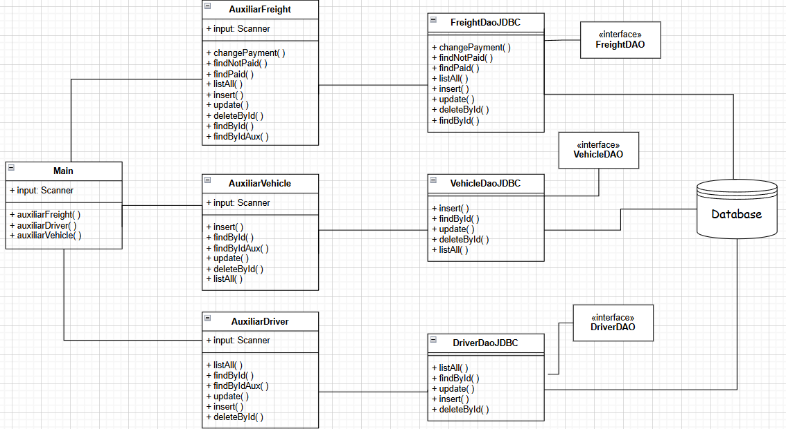

## Motivation 💭
The economy of my city is based on transportation companies, many of which are small. I have experience working in one of them, where freight, driver, and vehicle records were managed on paper. This system proposes an easy-to-use, extensible, and low-cost solution to help these companies.

## Transport System 🚛
The system allows the management of drivers, freights, and vehicles in a unified and flexible way. The core of the program is a CLI that interacts with the user according to the company’s needs. The provided and modified information is persistent through a database that runs locally on the machine.

The main structure is represented in the class diagram below:

* The main class models the user access menu and, according to the selected option, redirects to auxiliary classes (FreightAux, DriverAux, VehicleAux). These auxiliary classes contain the operations of each entity in the system and interact with DAO classes, which ultimately communicate with the database.

* This organization improves project cohesion and makes the system modular and extensible according to the specific characteristics of each company.

* The project includes exception handling so that the system continues running even when errors occur during data insertion.

* Tip for use (💡): New users are recommended to first add drivers and vehicles (which change less frequently) and then add freights.

## Technologies 🔍
This project uses Maven, JDBC, and the DAO/Factory design patterns.

## What you need to run 🪛
The system requires the following tools:
1. A computer with an operating system (Windows, Linux, or macOS);
2. Java installed — more information at https://www.oracle.com/br/java/technologies/downloads/;
3. MySQL installed on your machine — more information at https://www.mysql.com/downloads/.

## License 📖
Feel free to use or modify this system as you wish!

