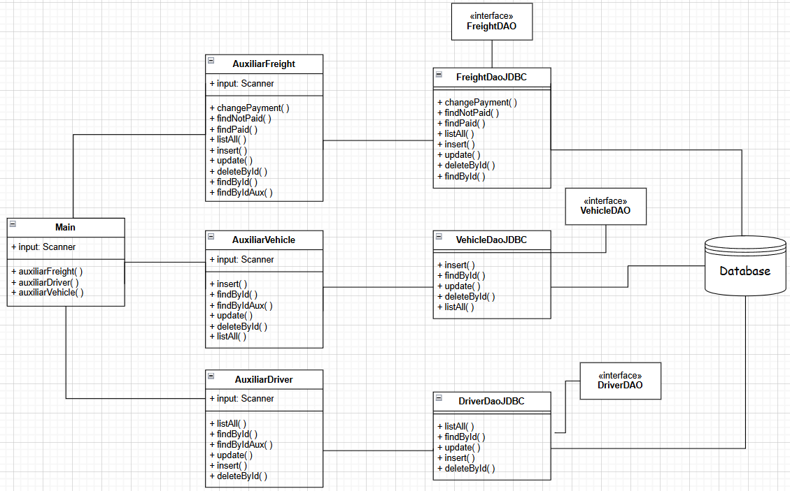

## Motivation 💭
The economy of my city is based on transportation companies, many of which are small. I have experience working in one of them, where freight, driver, and vehicle documents were organized on paper. This system proposes an easy-to-use, extensible and low-cost solution to help these companies.

## Transport System 🚛
O sistema possibilita administrar os motoristas, fretes e veiculos da empresa de uma maneira reunida e modificavel. A base do programa consiste em um terminal que interage com o usuario conforme as demandas da empresa. As informacoes fornecidas e alteradas possuem carater persistente oferecido pelo banco de dados que roda localmente na maquina.

A estrutura principal está representada no diagrama de classes abaixo:

-> A classe principal modela o menu de acesso com o usuario que, conforme a opcao selecionada, é direcionada para cada classe de funcoes auxiliares (FreightAux, DriverAux, VehicleAux). As classes auxiliares, por sua vez, contém as operacoes de cada entidade do programa; ao selecionar uma operacao, a classe auxiliar interage com as classes DAO que definitivamente interagem com o banco de dados.
-> Esse esquema de organizacao colabora para a concisao do projeto de forma que seja modular e extensível conforme caracteristicas mutáveis de empresa para empresa.

NOS TEMOS NESSE PROJETO TRATAMENTO DE EXCECAO, DE MODO QUE O PROGRAMA POSSA CONTINUAR OPERANDO 
MESMO FRENTE A ADVERSIDADES.
PARA USUARIOS INEXPERIENTES, OS VEICULOS E MOTORISTAS DEVEM SEMPRE SER ADICIONADOS ANTES DAS CARGAS.

Presente nesse projeto, temos as tecnologias: Maven, JDBC e os padroes DAO e Factory.
## What you need to run 🪛
The system need the tools below:
1. A computer with operational system (Windows, Linux or Mac OS);
2. Java instaled, more information in [https://www.oracle.com/bz/java/technologies/downloads/];
3. MySQL instaled in your machine, more information in [https://www.mysql.com/downloads/].

## License 📖
Feel free to use or modify the system as you wish!!!

